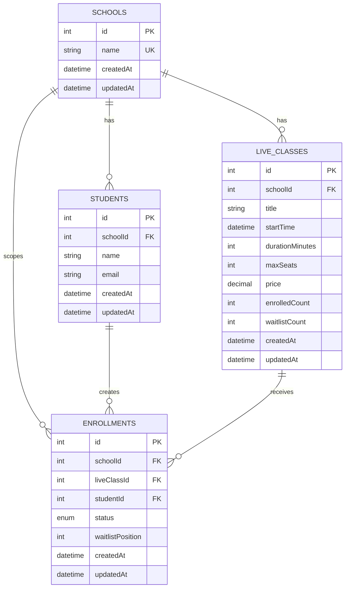

# ERD

This ERD reflects the current live class enrollment schema in `src/model`.

## Mermaid ER Diagram

## Table Notes

### `SCHOOLS`

| Type | Column | Key | Notes |
| --- | --- | --- | --- |
| int | `id` | PK | Auto increment |
| string | `name` | UK | Unique school name |
| datetime | `createdAt` |  | Sequelize timestamp |
| datetime | `updatedAt` |  | Sequelize timestamp |

### `STUDENTS`

| Type | Column | Key | Notes |
| --- | --- | --- | --- |
| int | `id` | PK | Auto increment |
| int | `schoolId` | FK | References `schools.id` |
| string | `name` |  | Student display name |
| string | `email` | UK* | Unique per school with `schoolId` |
| datetime | `createdAt` |  | Sequelize timestamp |
| datetime | `updatedAt` |  | Sequelize timestamp |

### `LIVE_CLASSES`

| Type | Column | Key | Notes |
| --- | --- | --- | --- |
| int | `id` | PK | Auto increment |
| int | `schoolId` | FK | References `schools.id` |
| string | `title` |  | Class title |
| datetime | `startTime` |  | Start datetime |
| int | `durationMinutes` |  | Duration in minutes |
| int | `maxSeats` |  | Max allowed enrollments |
| decimal | `price` |  | Class price |
| int | `enrolledCount` |  | Current enrolled seat count |
| int | `waitlistCount` |  | Current waitlist size |
| datetime | `createdAt` |  | Sequelize timestamp |
| datetime | `updatedAt` |  | Sequelize timestamp |

### `ENROLLMENTS`

| Type | Column | Key | Notes |
| --- | --- | --- | --- |
| int | `id` | PK | Auto increment |
| int | `schoolId` | FK | References `schools.id` |
| int | `liveClassId` | FK | References `live_classes.id` |
| int | `studentId` | FK | References `students.id` |
| enum | `status` |  | `ENROLLED` or `WAITLISTED` |
| int | `waitlistPosition` |  | Nullable for enrolled students |
| datetime | `createdAt` |  | Sequelize timestamp |
| datetime | `updatedAt` |  | Sequelize timestamp |

## Constraints

- `SCHOOLS.name` is unique.
- `STUDENTS` has a composite unique key on `schoolId + email`.
- `LIVE_CLASSES` has a composite unique key on `schoolId + title + startTime`.
- `ENROLLMENTS` has a composite unique key on `schoolId + liveClassId + studentId`.
- `ENROLLMENTS` also has a lookup index on `schoolId + liveClassId + status + waitlistPosition`.
